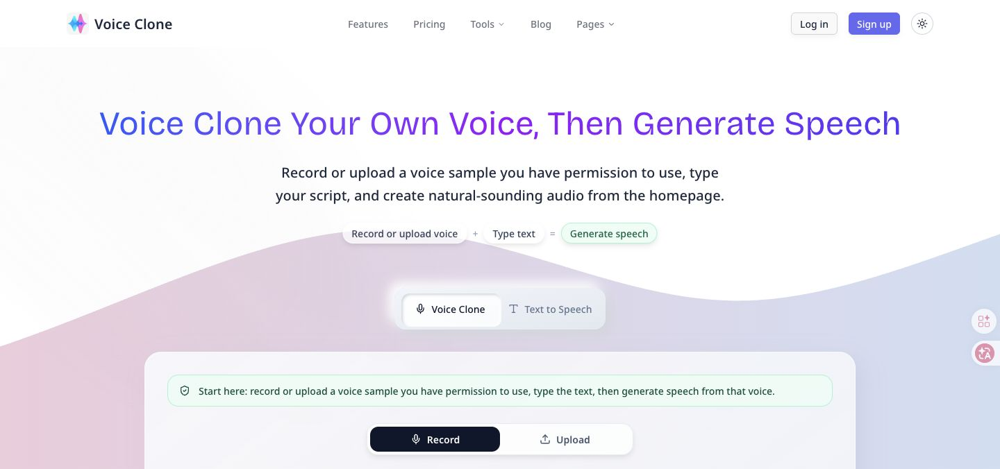

# TAN-392 Rework Evidence

Rework issue: TAN-392
Source issue: TAN-363
Review issue: TAN-377
PR: https://github.com/tanchaowen84/voice-clone/pull/32
Branch: `codex/tan-363-home-voice-action-20260517`

## Fix Summary

- Added a single-locale middleware path for the current Voice Clone config.
- `/` now rewrites internally to `/en` and returns `200`.
- `/en` now redirects once to same-host `/`, then returns `200`.
- Multi-locale configs still use the existing `next-intl` middleware path.

## Verification

Environment:

- Used the real local Voice Clone env from the repo `.env`.
- Secret values were not printed.

Commands:

```bash
pnpm install --frozen-lockfile
pnpm build
pnpm exec next start -p 3211
curl -sS -I http://127.0.0.1:3211/
curl -sS -I http://localhost:3211/en
curl -sS -L --max-redirs 5 -o /tmp/voice-clone-root.html -w '/ root: %{http_code} %{url_effective} redirects=%{num_redirects}\n' http://127.0.0.1:3211/
curl -sS -L --max-redirs 5 -o /tmp/voice-clone-en.html -w '/en: %{http_code} %{url_effective} redirects=%{num_redirects}\n' http://localhost:3211/en
curl -sS -L --max-redirs 5 -o /tmp/voice-clone-localhost-root.html -w 'localhost /: %{http_code} %{url_effective} redirects=%{num_redirects}\n' http://localhost:3211/
curl -sS -L --max-redirs 5 -o /tmp/voice-clone-127-en.html -w '127 /en: %{http_code} %{url_effective} redirects=%{num_redirects}\n' http://127.0.0.1:3211/en
```

Results:

```text
pnpm install --frozen-lockfile: passed, lockfile up to date
pnpm build: passed

HEAD http://127.0.0.1:3211/: 200 OK, x-middleware-rewrite: /en
HEAD http://localhost:3211/en: 307 Temporary Redirect, location: /

/ root: 200 http://127.0.0.1:3211/ redirects=0
/en: 200 http://localhost:3211/ redirects=1
localhost /: 200 http://localhost:3211/ redirects=0
127 /en: 200 http://127.0.0.1:3211/ redirects=1
```

## Chrome Validation

Used the required chrome:Chrome skill against `http://127.0.0.1:3211/`.

Result:

- Homepage rendered with title `Voice Clone - Instantly Clone Your Voice with AI Technology`.
- Final URL stayed `http://127.0.0.1:3211/`.
- Hero Voice Clone flow rendered: Record/Upload mode switch, Step 1 voice sample, Step 2 text/generation area, permission checkbox, and disabled generation until a sample exists.
- Chrome console error logs: none.
- Attempted Chrome filechooser upload flow against `input[type="file"]`; the Chrome wrapper timed out before returning a file chooser, so real upload/generation was not completed in Chrome. This is separate from the redirect-loop blocker; the homepage itself rendered and was operable.

Screenshot:


