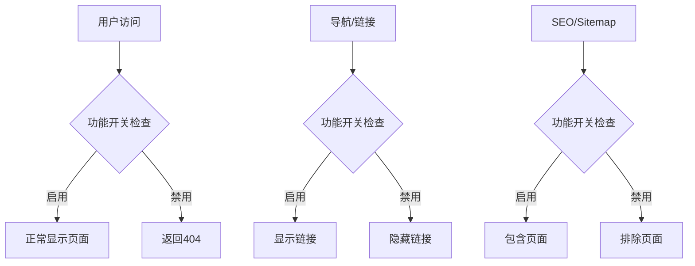

# SaaS 模板功能开关控制方案

## 概述

本文档详细说明了如何在不删除代码文件的前提下，通过配置化的方式控制 SaaS 模板中特定页面和功能的访问权限。该方案特别适用于产品初期需要隐藏未完善功能，或者需要分阶段发布功能的场景。

## 设计原则

### 三律原则
1. **精** - 复杂度低于原方案80%，实现简单高效
2. **准** - 直击根本原因，在多个层面进行控制
3. **净** - 零技术债务，易于维护和扩展

### 核心理念
- **代码保留** - 所有页面文件完全保持不变
- **配置驱动** - 通过配置文件控制功能开关
- **SEO友好** - 被禁用的页面对搜索引擎完全不可见
- **用户体验** - 用户完全感知不到被禁用功能的存在

## 技术架构

### 双重控制策略



### 控制层级

1. **路由级控制** - 页面组件级别的访问控制
2. **导航级控制** - 导航栏菜单的条件显示
3. **链接级控制** - 页脚和其他内链的条件显示
4. **SEO级控制** - 搜索引擎索引的条件包含

## 实现方案

### 1. 配置文件扩展

在 `src/config/website.tsx` 中添加页面级功能开关：

```typescript
export const websiteConfig: WebsiteConfig = {
  // ... 现有配置
  features: {
    // 现有功能开关
    enableDiscordWidget: false,
    enableUpgradeCard: true,
    enableAffonsoAffiliate: false,
    enablePromotekitAffiliate: false,
    
    // 新增页面级功能开关
    enableDocsPage: false,        // 控制文档页面
    enableAIPages: false,         // 控制AI功能页面
    enableBlocksPages: false,     // 控制UI组件展示页面
    enableMagicUIPages: false,    // 控制MagicUI页面
    enableWaitlistPage: true,     // 控制等候列表页面
    enableChangelogPage: true,    // 控制变更日志页面
    enableAboutPage: true,        // 控制关于页面
    enableContactPage: true,      // 控制联系页面
  },
  // ... 其他配置
};
```

### 2. 路由级控制

在页面的 layout 或主组件中添加功能检查：

```typescript
// src/app/[locale]/docs/layout.tsx
import { notFound } from 'next/navigation';
import { websiteConfig } from '@/config/website';

export default async function DocsRootLayout({
  children,
  params,
}: DocsLayoutProps) {
  // 功能开关检查
  if (!websiteConfig.features.enableDocsPage) {
    notFound(); // 返回标准404，让页面真正"不存在"
  }
  
  // 原有代码保持不变
  const { locale } = await params;
  const t = await getTranslations({ locale, namespace: 'DocsPage' });
  // ...
}
```

### 3. 导航级控制

修改 `src/config/navbar-config.tsx` 中的导航配置：

```typescript
export function getNavbarLinks(): NestedMenuItem[] {
  const t = useTranslations('Marketing.navbar');
  
  const links: NestedMenuItem[] = [
    {
      title: t('features.title'),
      href: Routes.Features,
      external: false,
    },
    {
      title: t('pricing.title'),
      href: Routes.Pricing,
      external: false,
    },
    {
      title: t('blog.title'),
      href: Routes.Blog,
      external: false,
    },
  ];
  
  // 条件性添加文档链接
  if (websiteConfig.features.enableDocsPage) {
    links.push({
      title: t('docs.title'),
      href: Routes.Docs,
      external: false,
    });
  }
  
  // 条件性添加AI功能菜单
  if (websiteConfig.features.enableAIPages) {
    links.push({
      title: t('ai.title'),
      items: [
        {
          title: t('ai.items.text.title'),
          description: t('ai.items.text.description'),
          icon: <SquarePenIcon className="size-4 shrink-0" />,
          href: Routes.AIText,
          external: false,
        },
        // ... 其他AI功能项
      ],
    });
  }
  
  // 条件性添加Blocks菜单
  if (websiteConfig.features.enableBlocksPages) {
    links.push({
      title: t('blocks.title'),
      items: [
        // ... blocks相关项目
      ],
    });
  }
  
  return links;
}
```

### 4. 页脚链接控制

修改 `src/config/footer-config.tsx` 中的页脚配置：

```typescript
export function getFooterLinks(): NestedMenuItem[] {
  const t = useTranslations('Marketing.footer');

  return [
    {
      title: t('product.title'),
      items: [
        {
          title: t('product.items.features'),
          href: Routes.Features,
          external: false,
        },
        {
          title: t('product.items.pricing'),
          href: Routes.Pricing,
          external: false,
        },
        {
          title: t('product.items.faq'),
          href: Routes.FAQ,
          external: false,
        },
      ],
    },
    {
      title: t('resources.title'),
      items: [
        {
          title: t('resources.items.blog'),
          href: Routes.Blog,
          external: false,
        },
        // 条件性添加文档链接
        ...(websiteConfig.features.enableDocsPage ? [{
          title: t('resources.items.docs'),
          href: Routes.Docs,
          external: false,
        }] : []),
        // 条件性添加变更日志链接
        ...(websiteConfig.features.enableChangelogPage ? [{
          title: t('resources.items.changelog'),
          href: Routes.Changelog,
          external: false,
        }] : []),
        {
          title: t('resources.items.roadmap'),
          href: Routes.Roadmap,
          external: true,
        },
      ],
    },
    {
      title: t('company.title'),
      items: [
        // 条件性添加关于页面链接
        ...(websiteConfig.features.enableAboutPage ? [{
          title: t('company.items.about'),
          href: Routes.About,
          external: false,
        }] : []),
        // 条件性添加联系页面链接
        ...(websiteConfig.features.enableContactPage ? [{
          title: t('company.items.contact'),
          href: Routes.Contact,
          external: false,
        }] : []),
        // 条件性添加等候列表链接
        ...(websiteConfig.features.enableWaitlistPage ? [{
          title: t('company.items.waitlist'),
          href: Routes.Waitlist,
          external: false,
        }] : []),
      ],
    },
    // ... 法律相关链接保持不变
  ];
}
```

### 5. SEO和搜索引擎控制

修改 `src/app/sitemap.ts` 中的网站地图生成：

```typescript
import { websiteConfig } from '@/config/website';

/**
 * 根据功能开关动态生成静态路由列表
 */
function getEnabledStaticRoutes(): string[] {
  const baseRoutes = [
    '/',
    '/pricing',
    '/blog',
    '/privacy',
    '/terms',
    '/cookie',
    '/auth/login',
    '/auth/register',
  ];
  
  // 条件性添加页面路由
  const conditionalRoutes: string[] = [];
  
  if (websiteConfig.features.enableDocsPage) {
    conditionalRoutes.push('/docs');
  }
  
  if (websiteConfig.features.enableAboutPage) {
    conditionalRoutes.push('/about');
  }
  
  if (websiteConfig.features.enableContactPage) {
    conditionalRoutes.push('/contact');
  }
  
  if (websiteConfig.features.enableWaitlistPage) {
    conditionalRoutes.push('/waitlist');
  }
  
  if (websiteConfig.features.enableChangelogPage) {
    conditionalRoutes.push('/changelog');
  }
  
  return [...baseRoutes, ...conditionalRoutes];
}

export default async function sitemap(): Promise<MetadataRoute.Sitemap> {
  const sitemapList: MetadataRoute.Sitemap = [];
  
  // 使用动态路由列表
  const staticRoutes = getEnabledStaticRoutes();
  
  // 添加静态路由
  sitemapList.push(
    ...staticRoutes.flatMap((route) => {
      return routing.locales.map((locale) => ({
        url: getUrl(route, locale),
        lastModified: new Date(),
        priority: 1,
        changeFrequency: 'weekly' as const,
      }));
    })
  );
  
  // 条件性添加文档页面
  if (websiteConfig.features.enableDocsPage) {
    const docsParams = source.generateParams();
    sitemapList.push(
      ...docsParams.flatMap((param) =>
        routing.locales.map((locale) => ({
          url: getUrl(`/docs/${param.slug.join('/')}`, locale),
          lastModified: new Date(),
          priority: 0.8,
          changeFrequency: 'weekly' as const,
        }))
      )
    );
  }
  
  // ... 其他sitemap生成逻辑保持不变
  
  return sitemapList;
}
```

## 应用示例

### 禁用文档功能

```typescript
// src/config/website.tsx
features: {
  enableDocsPage: false,  // 禁用文档页面
}
```

**效果：**
- ✅ 导航栏不显示"文档"链接
- ✅ 页脚不显示"文档"链接
- ✅ 访问 `/docs` 返回404页面
- ✅ sitemap.xml 不包含文档相关页面
- ✅ 搜索引擎无法发现文档内容

### 禁用AI功能

```typescript
// src/config/website.tsx
features: {
  enableAIPages: false,  // 禁用AI功能页面
}
```

需要在以下页面添加控制：
- `src/app/[locale]/(marketing)/ai/layout.tsx`
- `src/app/[locale]/(marketing)/ai/text/page.tsx`
- `src/app/[locale]/(marketing)/ai/image/page.tsx`
- `src/app/[locale]/(marketing)/ai/video/page.tsx`
- `src/app/[locale]/(marketing)/ai/audio/page.tsx`

### 禁用UI组件展示

```typescript
// src/config/website.tsx
features: {
  enableBlocksPages: false,   // 禁用Blocks页面
  enableMagicUIPages: false,  // 禁用MagicUI页面
}
```

## 开发工作流

### 1. 开发阶段
```typescript
// 开发环境可以开启所有功能进行测试
features: {
  enableDocsPage: true,
  enableAIPages: true,
  enableBlocksPages: true,
  // ...
}
```

### 2. 预发布阶段
```typescript
// 只开启已完善的功能
features: {
  enableDocsPage: false,     // 文档还未完善
  enableAIPages: false,      // AI功能还在开发中
  enableBlocksPages: true,   // UI组件已经完善
  // ...
}
```

### 3. 正式发布阶段
```typescript
// 逐步开放功能
features: {
  enableDocsPage: true,      // 文档已完善，可以发布
  enableAIPages: false,      // AI功能继续保持隐藏
  enableBlocksPages: true,   // UI组件继续开放
  // ...
}
```

## 优势分析

### 1. 开发效率
- **代码完整性** - 所有功能代码保持完整，便于开发和测试
- **配置简单** - 只需修改配置文件即可控制功能发布
- **版本管理** - 通过Git可以轻松管理不同环境的配置

### 2. 用户体验
- **界面一致** - 用户完全感知不到被禁用功能的存在
- **无错误链接** - 不会出现指向不存在页面的链接
- **渐进式体验** - 可以逐步为用户开放新功能

### 3. SEO优化
- **搜索友好** - 被禁用页面不会被搜索引擎索引
- **无404错误** - 避免大量404页面影响SEO评分
- **内容质量** - 只展示完善的内容给搜索引擎

### 4. 运维便利
- **热更新** - 可以通过配置文件快速开启/关闭功能
- **A/B测试** - 便于进行功能的灰度发布
- **回滚简单** - 出现问题时可以快速禁用功能

## 注意事项

### 1. 配置同步
- 确保所有相关文件都添加了功能开关检查
- 定期检查是否有遗漏的链接或引用

### 2. 测试覆盖
- 测试功能开启和关闭两种状态
- 验证导航、链接、SEO等各个层面的控制效果

### 3. 文档维护
- 及时更新功能开关的说明文档
- 记录各个功能的开发和发布状态

## 扩展应用

该方案不仅适用于页面级控制，还可以扩展到：

- **组件级控制** - 控制页面内特定组件的显示
- **功能级控制** - 控制特定功能模块的可用性
- **权限级控制** - 结合用户权限进行功能控制
- **环境级控制** - 不同环境开启不同功能集合

## 总结

通过配置化的功能开关控制方案，我们实现了：

1. **精简高效** - 复杂度远低于删除/恢复文件的方案
2. **精准控制** - 在路由、导航、SEO等多个层面进行控制
3. **零技术债务** - 代码结构清晰，易于维护和扩展

这个方案特别适合SaaS产品的渐进式功能发布，既保证了代码的完整性，又提供了灵活的功能控制能力。 